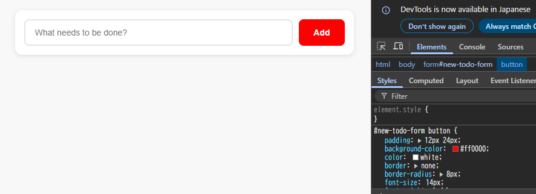
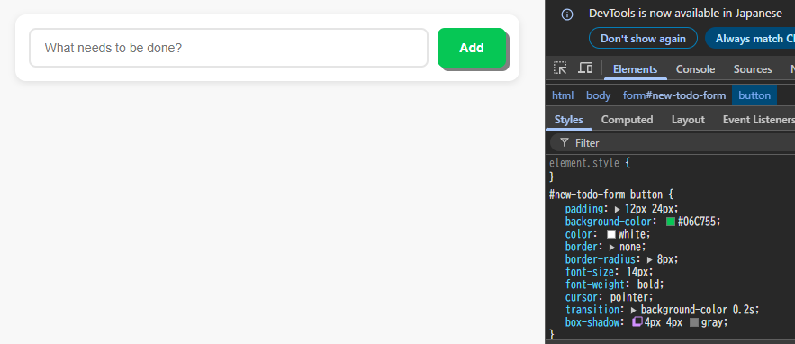

# 開発者ツール

## 1. ブラウザの開発者ツールから値の変更やプロパティの追加

15.4-10.1 および 15.4-10.2 の ToDo アプリに対してブラウザの開発者ツールから値の変更やプロパティの追加を試してみなさい

### 値の変更

**ボタンの色を赤にする**

```css
background-color: #FF0000;
```



### プロパティの追加

**ボタンにbox-shadowを追加**

```css
box-shadow: 4px 4px gray;
```



---

## 2. 開発者ツールで実行できる便利なCSS操作

開発者ツールで CSS に関して実行できる操作を検索エンジンで調べ、便利だと思ったものを 3 つ挙げなさい

### CSSの有効/無効の切り替え
- チェックボックスを切り替えることでプロパティの有効/無効を切り替えられる

### 疑似クラスの適用
- 実際にホバーやクリックをしなくても、ホバーやクリックしたときの変化を確認できる

### 要素のサイズを変更する
- 要素の幅や高さ、パディング、余白、枠線を変更することができる

**参考**: https://developer.chrome.com/docs/devtools/css?hl=ja

---

## 3. Tailwind CSSで開発者ツールから追加したクラスが反映されない理由

15.4-10.2 のアプリの body 要素に対し、元々 HTML および JS 内で利用していなかった Tailwind CSS のクラス (bg-rose-600 など何でも良い) を開発者ツールから追加すると変更が反映されないが、これは何故か調べなさい

### 理由

Tailwind CSSは実際に使用したクラスに基づいて必要なCSSをすべて生成するため、開発者ツールで後から追加したクラスは生成されていないことで適用されない。

**参考**: https://tailwindcss.com/docs/detecting-classes-in-source-files