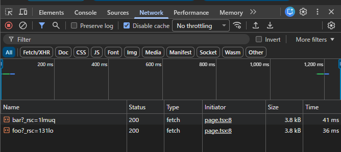

## 1. 以下の動作を確認しなさい

### ブラウザの開発者ツールの「ネットワーク」タブを確認してみよう。リンクをクリックしたときに通信は発生しているだろうか？
- 発生している（fetch）  

### pushState はいつ実行されているだろうか？
- URLが変わったタイミングで実行されている

### リロード時に画面の表示はどうなるだろうか？
- URLはそのままで、画面もエラーにはならず正しく表示される

## 2. 1 で確認した動作と 15.4-10.12 で確認した動作を比較し、next.js の Link でどういった処理が行われているかをまとめなさい。

### 15.4-10.12（pushState）
- リンクのクリックで通信が発生しない
- リロードすると404エラーになる

### next.js
- リンクのクリックで通信が発生する
- リロードしても正しく表示される

### next.js の Link の処理
- URLは変わるが、ドキュメントの再取得はしない
- 代わりに `fetch` でデータを取得している
- Linkのクリックで `pushState` が実行され、ブラウザの履歴を更新する
