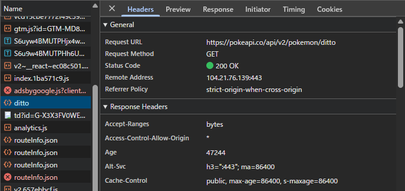

# 調査した API

## PokeAPI

**URL**: https://pokeapi.co/

**エンドポイント例**:
```
https://pokeapi.co/api/v2/pokemon/ditto
```

**CORS 設定**:
- `Access-Control-Allow-Origin: *`
- すべてのオリジンからのアクセスを許可している

**確認結果**:


