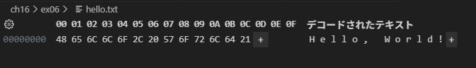
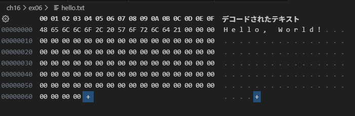

## fs.truncate()
指定した長さ(バイト数)になるようにファイルサイズを更新する関数

### fs.truncate()を利用してファイルサイズを拡張した場合、不足分には何が書き込まれるか
### 結果：nullバイト(`00`)が書き込まれる

---

### 実行コード
```js
// hello.txtを100バイトに拡張する
fs.truncateSync("./ch16/ex06/hello.txt", 100);
```

### 拡張前
- 内容：`Hello, World!`
- サイズ：13バイト



### 拡張後
- 内容：`Hello, World! + nullバイト`
- サイズ：100バイト

