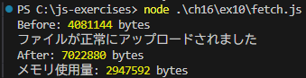
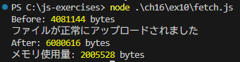

### `fs.createReadStream` を利用した場合
2947592 bytes  

### `fs.read` を利用した場合
2005528 bytes  

`fs.read` を利用した場合の方が `fs.createReadStream` を利用した場合よりもメモリ使用量が少ない結果になった。

`fs.createReadStream` を使う場合、ストリームになるのでメモリ使用量が少なくなると思ったがそうならなかった。