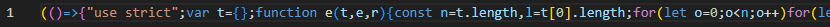
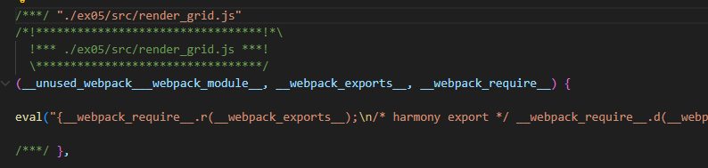

## バンドルしたコードと元のコードを比較し、どのような処理が行われたか
### mode: productionの場合

すべてのファイルが1行にまとめられる

### mode: developmentの場合

ファイルごとに1行に変換されてまとめられる

例：render_grid.jsを変換した部分

---

## バンドル前後それぞれのコードを利用するページをローカルサーバで配信し、開発者ツールからスクリプトのダウンロード時間、ページの読み込み完了時間について比較する

**スクリプトのダウンロード時間**
- バンドル前のコード：約 20 ms
- バンドル後のコード：約 8 ms

**ページの読み込み完了時間**
- バンドル前のコード：120~140 ms
- バンドル後のコード：100~120 ms

**理由**  
バンドル前のコードは3ファイル読み込む必要があるのに対し、バンドル後は1ファイルだけでよいため、読み込むファイル数の分読み込み時間が増えている