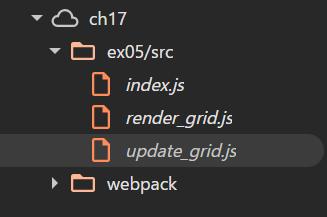

# 問題 17.5 について、webpack の設定でバンドル時にソースマップを生成するようにしなさい。 バンドルしたコードを利用するページをローカルサーバで配信してブラウザから閲覧し、開発者コンソールを利用して以下を確認して結果を記載しなさい。

## 開発者ツールでソースタブを開き、ソースコードファイルがどのように表示されるか

### 設定

`webpack.config.js`に以下を追加
```js
devtool: "source-map",
```
main.js.mapが生成された

### 結果

ファイルごとに元のコードの中身が見れるようになった



## バンドルしたコードの実行中に、バンドル前のソースコードファイルに基づいたブレークポイントの設定や変数の値の確認等のデバッグが可能か
### デバッグは可能
ソースマップで生成された元のソースコードファイルに対してブレークポイントの設定や変数の値をウォッチしてデバッグができた。